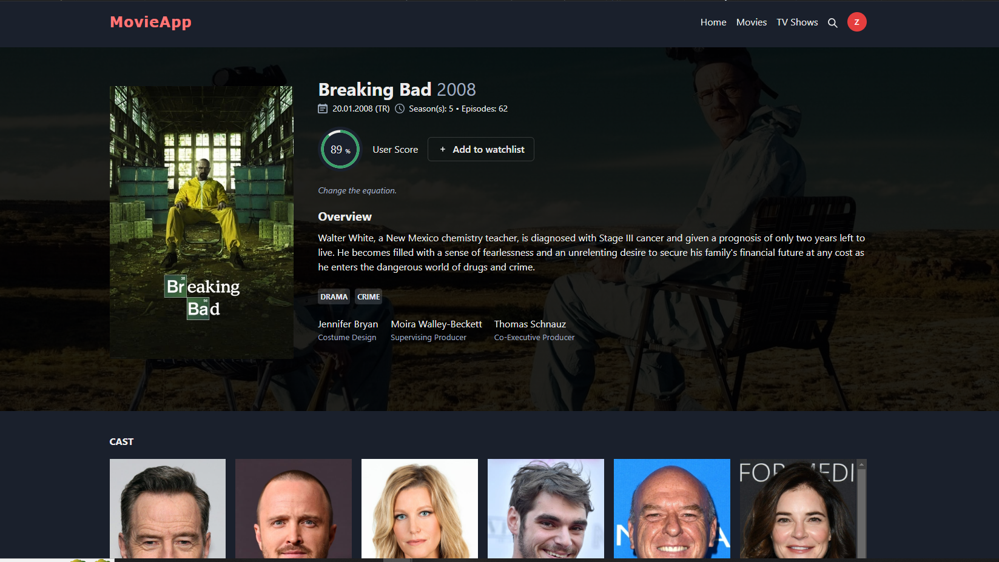

# Movie App

A React.js application that fetches movie, TV show and person data from TMDB and showcases it as cards. The app includes various features such as a trending page, movie and TV show pages with popular and top-rated options, and a search page where users can search 
for TV shows, movies, and actors/actresses. It uses Firebase and Firestore for authentication, allowing users to log in via Google and manage a watchlist.





## Features

- **Trending Page**: Displays trending movies and TV shows.
- **Movies Page**: Lists popular and top-rated movies.
- **TV Shows Page**: Lists popular and top-rated TV shows.
- **Search Page**: Allows users to search for TV shows, movies, and actors/actresses.
- **Authentication**: Users can log in using Google authentication.
- **Watchlist**: Users can add movies and TV shows to their watchlist.

## Technologies Used

- **Frontend**: React+Vite, Chakra.UI
- **Backend**: Node.js
- **Database**: Firestore, Firebase
- **API**: The Movie Database (TMDB) API

## Getting Started

### Prerequisites

- Node.js
- npm or yarn

### Installation

1. Clone the repository:
   ```bash
   git clone https://github.com/your-username/movie-app.git
2. Navigate to the project directory:
   ```bash
   npm install or yarn install
### Configuration

1. Create a `.env` file in the root directory and add your TMDB API key and Firebase configuration::
   ```bash
    REACT_APP_TMDB_API_KEY=your_tmdb_api_key
    REACT_APP_FIREBASE_API_KEY=your_firebase_api_key
    REACT_APP_FIREBASE_AUTH_DOMAIN=your_firebase_auth_domain
    REACT_APP_FIREBASE_PROJECT_ID=your_firebase_project_id
    REACT_APP_FIREBASE_STORAGE_BUCKET=your_firebase_storage_bucket
    REACT_APP_FIREBASE_MESSAGING_SENDER_ID=your_firebase_messaging_sender_id
    REACT_APP_FIREBASE_APP_ID=your_firebase_app_id
### Running the Application
1. Start the development server:
   ```bash
    npm start
    # or
    yarn start
2. Open your browser and navigate to `http://localhost:3000`

##Usage
1. Login: Click on the person button on up right and "Login with Google".
2. Browse Movies and TV Shows: Browse through the trending, popular, and top-rated sections.
3. Search: Use the search bar to find movies, TV shows, and actors/actresses.
4. Watchlist: Add movies and TV shows to your watchlist.

## Acknowledgements

- [TMDB API](https://www.themoviedb.org/documentation/api)
- [Firebase](https://firebase.google.com/)
- [React.js](https://reactjs.org/)
- [Vite](https://vitejs.dev/guide/)
